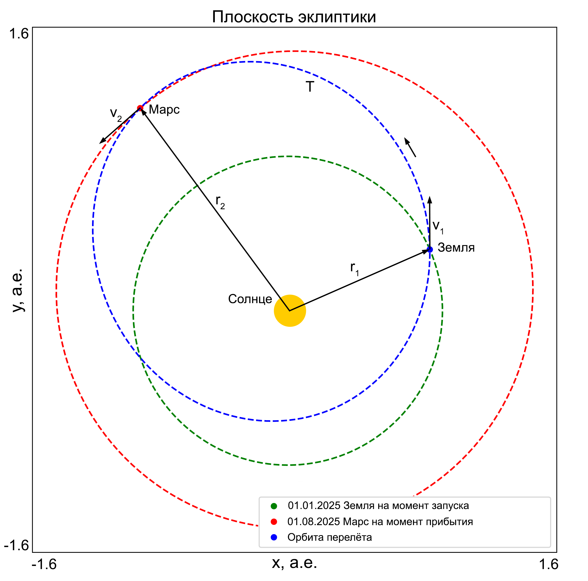

# Применение машинного обучения в задаче Ламберта для анализа и прогнозирования параметров межпланетных траекторий с учётом гравитационных возмущений

---

## Описание проекта

В работе представлен подход к решению задачи Ламберта с помощью методов **машинного обучения** для прогнозирования параметров межпланетных траекторий, включая начальные и конечные скорости космического аппарата, запас характеристической скорости, оптимальную дату старта и время перелёта. Решение учитывает гравитационные возмущения от планет Солнечной системы и Луны, а также несферичность Земли.

Целью проекта является **сокращение времени расчёта межпланетных траекторий** для миссий космических аппаратов. Машинное обучение используется для генерации предположений, которые ***уточняются классическими методами оптимизации***.



---

## Основные возможности

- **Прогнозирование ключевых параметров траектории**:
  - Начальные и конечные скорости перелёта;
  - Характеристическая скорость (ΔV);
  - Время полёта;
  - Оптимальная дата старта.
- Учёт гравитационных возмущений, включая несферичность Земли (J2, J3, J4).
- Поддержка всех планет Солнечной системы, их основных спутников и астероидов из Главного пояса.
- Быстрая генерация предположений для последующего уточнения оптимизационными алгоритмами.

---

## Структура данных

### Датасет
- **Размер**: 2830 траекторий.  
- **Целевые переменные**:
  - Компоненты начальной скорости перелёта (`v1_transfer_x_km_s`, `v1_transfer_y_km_s`, `v1_transfer_z_km_s`);
  - Компоненты конечной скорости перелёта (`v2_transfer_x_km_s`, `v2_transfer_y_km_s`, `v2_transfer_z_km_s`);
  - Время полёта в днях (`tof_days_d`);
  - Характеристическая скорость (`delta_v_km_s`);
  - Оптимальная дата старта относительно опорной даты 2025-01-01 (`days_to_launch`).  

### Метрики модели
- RMSE, MSE, R² для всех целевых переменных.  

### Методология обработки данных
1. **Стандартизация целевых переменных** с использованием `MinMaxScaler`.
2. **Разделение выборок**:
   - Обучающая: 60%.
   - Валидационная: 20%.
   - Тестовая: 20%.

---

## Модель

- **Алгоритм**: `CatBoost`.
- **Гиперпараметры**:
  - Глубина деревьев: 7.
  - Итерации: 8000.
  - Скорость обучения: 0.05.
- **Функция потерь**:
  - Основная: RMSE.

---

## Установка и запуск

### Требования
- Python 3.8+
- Установленные библиотеки:
  - `astropy==4.3.1`
  - `astroquery==0.4.7`
  - `catboost==1.2.7`
  - `jplephem==2.22`
  - `matplotlib==3.5.3`
  - `numpy==1.21.6`
  - `pandas==1.3.5`
  - `poliastro==0.16.0`
  - `requests==2.31.0`
  - `scikit-learn==1.0.2`
  - `scipy==1.7.3`
  - `skyfield==1.49`

### Установка
```bash
git clone https://github.com/O4ernenko/Trajectory-params-prediction
cd Trajectory-params-prediction
pip install -r requirements.txt
```

---

### Инференс модели
1. Клонируйте этот репозиторий на свой ПК и запустите файл ```optimization.py``` в папке ```scripts```;
2. Вам будет предложено ввести параметры миссии;
3. Далее будут выведены предсказанные и оптимальные характеристики перелёта и сохранены в файл ```Result_Trajectory_Parameters.txt```.

---

## Результаты

- **Точность модели**:
  - RMSE для скоростей: 0.32-0.72 км/с;
  - RMSE для времени полёта: 48.83 дней;
  - RMSE для оптимальной даты старта: 14.83 дня;
  - RMSE для характеристической скорости: 0.939 км/с.


- **Пример предсказания: Для полёта к Марсу, MRO (США, 2005):**
  - Время полёта: ~248 дней (после уточнения — 210 дней).
  - Характеристическая скорость: 12.2 км/с (после уточнения — 2.4 км/с).
  - Время расчета - ~2 секунды

---

## Разработчики
- **Автор**: Черненко О.С.
- **Научный консультант**: Колпинский С.В.

## Контакты:
В случае возниконовения вопросов и предложений, обращайтесь к Черненко Ольге:
- Почта: [sol4.ch@mail.ru](mailto:sol4.ch@mail.ru) или [o.chernenko@cosmos.ru](mailto:o.chernenko@cosmos.ru)
- Telegram: [@sepulk_a](https://t.me/sepulk_a)
- VK: [id84302479](https://vk.com/id84302479)

---

## Благодарности

Работа была поддержана **Некоммерческим фондом содействия науке и образованию **"Интеллект"**.**